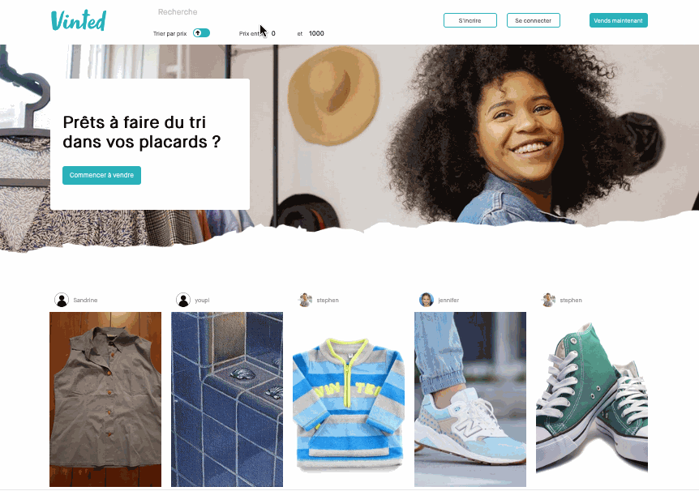

<div align="center">

</div>

<div align="center">
  <h1> Vinted Clone </h1>
</div>

<div align="center">
  
</div>

#### Try it <a href="https://priceless-curran-4fa3e5.netlify.app/" target="_blank">online !</a>

## 🖥 Features

- SignUp and LogIn
- Visualize all offers, search and filters
- See details of an offer
- Payment
- Publish an offer
- User's and offer's data are stored in a MongoDB database (to see backend repository, click <a href="https://github.com/GwendolineD/vinted-Le-Reacteur" target="_blank">here</a>)


## 📸 Screen shots

<div align="center" >

  
  </div>
  
<div align="center">
  
  
</div>

## 🛠 Technologies, packages ...

- React
- React-router-dom
- react-dropzone
- react-loader-spinner
- react-stripe-js
- Axios
- js-cookie
- Yarn

## 👀 Run the project

Clone the repository :

```
git clone https://github.com/GwendolineD/vinted-frontend.git
cd vintend-frontend
```

Install the dependencies :

```
yarn install
```

Then run the project :

```
yarn start
```
